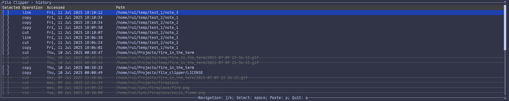

# 📋 file_clipper

⚡ **Supercharge your terminal with GUI-style copy, cut, and paste operations!**

`file_clipper` is a blazingly fast command-line utility written in Rust 🦀 that brings intuitive file management to your terminal. Experience the familiar "copy," "cut," and "paste" workflow you love from graphical interfaces, now with the speed and efficiency of the command line. Features an interactive TUI for clipboard management and operation history tracking.

[](https://asciinema.org/a/7Ud1g6tU4eL2oDuZu66Nwpi2p)

## ✨ Features

- **📄 Copy Files:** Copy one or more files to a temporary clipboard.
  - `clp copy <path>...`
  - Aliases: `cp`, `c`, `y`
- **✂️ Cut/Move Files:** Move one or more files to a temporary clipboard.
  - `clp cut <path>...`
  - Aliases: `mv`, `x`, `d`
- **🔗 Link Files:** Copy one or more files as symbolic links.
  - `clp link <path>...`
  - Aliases: `ln`, `s`
- **📌 Paste Files:** Paste files from the clipboard to a specified destination.
  - `clp paste [destination_path]`
  - Aliases: `p`, `v`
  - If `destination_path` is omitted, files are pasted into the current directory.
- **📋 List Clipboard:** View the contents of the current clipboard.
  - `clp list`
  - Alias: `l`
- **📜 View History:** Browse a history of all past copy/cut/paste operations.
  - `clp history`
  - Alias: `h`
- **🧹 Clear:** Clear the clipboard and history.
  - `clp clear`
- **🖥️ Interactive TUI:** The `list` and `history` commands launch an interactive terminal interface, allowing you to select specific files for pasting and manage entries with ease.
- **🌟 Glob Pattern Support:** Supports glob patterns for selecting multiple files (e.g., `*.txt`, `src/**/*.rs`).

### 🔄 Clipboard and History Mechanics

When files are cut or copied, they are placed into a temporary clipboard. Upon a successful paste operation, these files are automatically removed from the clipboard and recorded in the history, providing a persistent log of all file operations.

## 📦 Installation

### Via Cargo

To install `file_clipper`, you need to have [Rust and Cargo](https://www.rust-lang.org/tools/install) installed on your system.

```bash
cargo install file_clipper
```

### 🐧 Arch Linux (AUR)

For Arch Linux users, `file_clipper` is available on the AUR:

```bash
pacman -S file_clipper
```

### ❄️ Nix Flakes

For Nix users with flakes enabled, you can run `file_clipper` directly:

```bash
# Run directly
nix run github:ruiiiijiiiiang/file_clipper

# Or add to your flake inputs
{
  inputs.file_clipper.url = "github:ruiiiijiiiiang/file_clipper";
}

# Then include in your packages
environment.systemPackages = [
  inputs.file_clipper.packages.${system}.default
];
```

## 🚀 Usage

Here are some basic examples of how to use `clp`:

```bash
# Copy a single file
clp copy my_document.txt

# Copy multiple files using a glob pattern
clp cp 'images/*.png'

# Cut a directory
clp cut my_folder/

# Copy a file as a symlink
clp ln .dotfile

# Paste files to the current directory
clp paste

# Paste files to a specific destination
clp p /home/user/documents/

# List current clipboard contents (launches TUI)
clp list

# View operation history (launches TUI)
clp history

# Remove all clipboard and history entries
clp clear
```

### 🎨 TUI Interaction



When the TUI is launched (e.g., with `clp list` or `clp history`):

- **Navigation:** Use `j` or `k` (or arrow keys) to move up and down. Use `Ctrl+d` and `Ctrl+u` to scroll half a page, and `Ctrl+f` and `Ctrl+b` to scroll a full page. Press `g` to go to the top and `G` to go to the bottom.
- **Selection:** Press `space` to select/unselect individual entries. Press `a` to select/unselect all entries.
- **Actions:**
  - `p` or `Enter`: Paste the selected files
  - `x` or `d`: Remove the selected entry from the clipboard (only available in clipboard mode).
  - `q` or `Ctrl+c`: Exit the TUI.

## 🗑️ Uninstalling

`file_clipper` stores record files at `$HOME/.local/state/file_clipper`. You should run `clp clear` prior to uninstalling to remove these files.

After clearing the records, you can uninstall the application using your package manager (e.g., `cargo uninstall file_clipper`, `pacman -R file_clipper`, or `nix profile remove`).

## 🤝 Contributing

Contributions are welcome! Please feel free to open issues or submit pull requests.

## 📄 License

This project is licensed under the [MIT License](./LICENSE).
